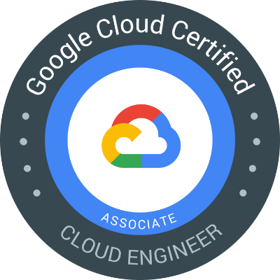
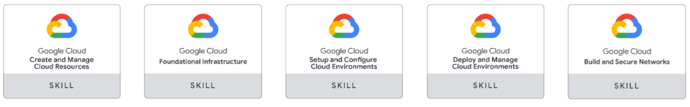

# Associate Cloud Engineer

Una lista seleccionada de recursos para aprender sobre la certificacion de Google Cloud certified Cloud Engineer y cómo prepararse para ella. Contiene guías, publicaciones de blog, cuestionarios de autoevaluación, tutoriales y más.

 
  
   

# Contenido

Tenemos una lista de 6 topicos importantes para el estudio del examen **Associate Cloud Engineer (ACE)**. Elija el que topico de su preferencia y nuestros enlaces de referencia le enviara directamente al área correcta.

- [Acerca el Examen ](#Acerca-el-Examen )
- [Publicaciones](#Publicaciones)
- [Libros](#Libros)
- [Videos / Sesiones](#Videos-Sesiones)
- [Capacitaciones en línea](#Capacitaciones-en-línea)
- [Enlaces de Qwiklabs](#Enlaces-de-Qwiklabs)
- [Registro examen de certificación](#Registro-examen-de-certificación)

## Acerca el Examen 
Contiene la descripcion general y resumida del examen de Certififacion **Associate Cloud Engineer (ACE)**

 

|***CONTENIDO*** | ***DESCRIPCION***|
| :---:         |     :---      |
| **Enlace Oficial:** | https://cloud.google.com/certification/cloud-engineer | 
| **Experiencia:** | Intermedio | 
| **Duracion:** | 2 horas | 
| **Costo de inscripción:** | 125 USD (adicional los impuestos cuando corresponda). Hay un descuento para aquellos países con menor paridad de poder adquisitivo. | 
| **Formato del examen:** | Opción múltiple y selección múltiple, tomada en persona en un centro de pruebas [ centro de evaluación cercana](https://www.kryteriononline.com/Locate-Test-Center), o en línea supervisado desde una ubicación remota. Consulta los  [requisitos](https://www.webassessor.com/wa.do?page=certInfo&branding=GOOGLECLOUD&tabs=13) del examen en línea . | 
| **Experiencia recomendada:** | 6 meses + experiencia práctica con Google Cloud Platform. | 
| **Examen de práctica oficial:** | https://cloud.google.com/certification/practice-exam/cloud-engineer | 

## Publicaciones

Resumen de los blogs de diferentes publicaciones sobre el examen **Associate Cloud Engineer (ACE)**

| ***Fecha de Publicación*** | ***Título / Enlace*** | ***Autor*** |
| :---:         |     :---      |          :--- |
| 2020/09 | [How I prepared for Google Associate Cloud Engineer (ACE) Exam](https://rakeshvardan.hashnode.dev/how-i-prepared-for-google-cloud-certified-associate-cloud-engineer-exam) | Rakesh Vardan |
| 2020/07 | [From ALC to Google ACE](https://medium.com/@MercyMarkus/from-alc-to-google-certified-associate-cloud-engineer-b7e5707f9bf0) | Mercy Markus |
| 2020/03 | [How I Passed the Google ACE](https://medium.com/@charles_j/how-i-passed-the-google-cloud-associate-engineer-certification-63a0fd932057) | Charles J |
| 2019/12 | [How to plan and clear Google Cloud ACE Certificate](http://www.legendshub.com/blog/2019/12/24/how-to-plan-and-clear-google-cloud-associate-certificate-legendshub-blog/) | amrit_3327 |
| 2019/11 | [How to Ace the Certification](https://telegraphhillsoftware.com/google-cloud-certification-ace/) | Blake Rogers |
| 2019/05 | [Notes from my ACE — Section 2](https://medium.com/@fahed.dorgaa/notes-from-my-google-cloud-associate-cloud-engineer-section-2-5469797b1079) | Fahed Dorgaa |
| 2019/04 | [Notes from my ACE — Section 1](https://medium.com/@fahed.dorgaa/i-have-passed-the-associate-cloud-engineer-exam-373076d07288) | Fahed Dorgaa |
| 2019/03 | [Google Cloud Certification : ACE](https://medium.com/devopslinks/google-cloud-certification-associate-cloud-engineer-dc25765a23e2) | Raj |
| 2019/03 | [Google ACE Certification Exam: Our Tips for Success](https://www.mobilise.cloud/blog/google-associate-cloud-engineer-exam) | mobilise.cloud |
| 2018/12 | [How I Cleared 3 Google Cloud Certifications in 3 Weeks](https://medium.com/@yesdeepakverma/how-i-cleared-all-3-google-cloud-certifications-in-3-weeks-f5591aa22572) | Deepak Verma | 
| 2018/11 | [Writing and Passing the Google Cloud Associate Engineer Certification](https://medium.com/@sathishvj/writing-and-passing-the-google-cloud-associate-engineer-certification-a60c2f6d99c2) | Sathish VJ |
| 2018/08 | [ACE Certification Exam Overview- Things to do](https://medium.com/@achilleslinux/associate-cloud-engineer-certification-exam-overview-things-to-do-466c7b9a2885) | Avinash Kumar |
| 2018/05 | [ACE — Study Guide](https://medium.com/@joaovitor/associate-cloud-engineer-study-guide-cf7e74da1bb6) | João Vitor Guimarães |

### Libros

Lista de los libros mas importates con sus respectivos autores y fechas de publicaciones para complementar el aprendizaje de Google Cloud Platform.

| ***Fecha de Publicación*** | ***Título / Enlace*** | ***Autor*** |
| :---:         |     :---     |       :--- |
|2019/03 | [Google Cloud Certified Associate Cloud Engineer Study Guide](https://www.google.com/search?q=official+google+cloud+certified+associate+cloud+engineer+study+guide) | [Dan Sullivan](https://www.google.com/search?sa=X&biw=1536&bih=731&sxsrf=ALeKk02b_f2l0dihSFstzyHnaJpovXxgzA:1605549031345&q=Dan+Sullivan&stick=H4sIAAAAAAAAAOPgE-LVT9c3NMwwqMwpyqsoUOIBc8uys4tNjMq0ZLKTrfST8vOz9cuLMktKUvPiy_OLsq0SS0sy8osWsfK4JOYpBJfm5GSWJebtYGUEAGivc-JPAAAA&ved=2ahUKEwiqzrqd0IftAhVrIbkGHSHgAbgQmxMoATAYegQIExAD) |
|2018/04 | [Google Cloud Platform Cookbook](https://www.google.com/search?q=Google+Cloud+Platform+Cookbook+by+Legorie+Rajan+PS) |[Legorie Rajan PS](https://www.google.com/search?sa=X&biw=1536&bih=731&sxsrf=ALeKk00DU0aXfKr-3JXeQvwSb_8mfM6eWg:1605548936281&q=Legorie+Rajan&stick=H4sIAAAAAAAAAOPgE-LVT9c3NEzPMEuqMC8xUIJys5OyTYrLi7RkspOt9JPy87P1y4syS0pS8-LL84uyrRJLSzLyixax8vqkpucXZaYqBCVmJebtYGUEAC-gW55RAAAA&ved=2ahUKEwihspDwz4ftAhX9JrkGHY0-D3oQmxMoATAYegQIFBAD&cshid=1605549059640179)  |
|2018/08 | [Google Cloud Platform in Action](https://www.google.com/search?q=Google+Cloud+Platform+in+Action+JJ+Geewax) |[JJ Geewax](https://www.google.com/search?sa=X&biw=1536&bih=731&sxsrf=ALeKk016K9ih0qCzNLiVMhdAjq4uphBinA:1605549138155&q=JJ+Geewax&stick=H4sIAAAAAAAAAOPgE-LVT9c3NEw2tcwuNC5IU4Jw0wyNsoqLSjK0ZLKTrfST8vOz9cuLMktKUvPiy_OLsq0SS0sy8osWsXJ6eSm4p6aWJ1bsYGUEAPptTitNAAAA&ved=2ahUKEwjQ67HQ0IftAhVsL7kGHb2SDfQQmxMoATAZegQIERAD)  |

### Videos Sesiones

Videos publicados donde se describe y dan un resumen del examen **Associate Cloud Engineer (ACE)**.

| ***Fecha de Publicación*** | ***Título / Enlace*** | ***Editor*** | ***Autor*** |
| :---:         |     :---     |     :---       |          :--- |
|2020/10 | [Preparing for Google Cloud ACE Exam](https://youtu.be/RbIbS0YMFs4) |  [Google Cloud](https://www.youtube.com/channel/UCTMRxtyHoE3LPcrl-kT4AQQ)| Parvez Mulla |
|2020/02 | [The Certified Q&A - ACE Playlist](https://www.youtube.com/watch?v=MESzvFfGhN8&list=PLQMsfKRZZviRwqJwNmh1eAWnRMvlrk40x) | [AwesomeGCP](https://www.youtube.com/channel/UCIGDDqu5DzlaaC4XzXj_4-A)| Sathish VJ |

### Capacitaciones en línea

Los cursos y capacitaciones de manera e-learning del contenido de **Associate Cloud Engineer (ACE)**.

| ***Site*** | ***Título / Enlace*** |***Tipo*** |***Duración*** |
| :---:         |     :---      |:---      |:---      |
| Coursera | [Architecting with Google Compute Engine](https://www.coursera.org/specializations/gcp-architecture) | Especialización | 3 meses |
| Coursera | [Getting Started with Google Kubernetes Engine](https://www.coursera.org/learn/google-kubernetes-engine?) | Curso| 13 horas |
| Coursera | [Preparing for the Google Cloud ACE Exam](https://www.coursera.org/learn/preparing-cloud-associate-cloud-engineer-exam) |Curso| 8 horas |
| Coursera | [Google Cloud Platform Fundamentals: Core Infrastructure](https://www.coursera.org/learn/gcp-fundamentals) |Curso| 12 horas |
| Coursera | [Architecting with Google Cloud Platform Specialization](https://www.coursera.org/specializations/gcp-architecture) | Especialización | 3 meses |
| Coursera | [Essential Google Cloud Infrastructure: Foundation](https://www.coursera.org/learn/gcp-infrastructure-foundation) |Curso| 8 horas |
| Coursera | [Essential Google Cloud Infrastructure: Core Services](https://www.coursera.org/learn/gcp-infrastructure-core-services) |Curso| 9 horas |
| Coursera | [Elastic Google Cloud Infrastructure: Scaling and Automation](https://www.coursera.org/learn/gcp-infrastructure-scaling-automation) |Curso| 9 horas |
| Coursera | [Introduction to Cloud Identity](https://www.coursera.org/learn/cloud-identity) |Curso| 11 horas |
| Udemy | [Google Cloud Platform ACE Bootcamp](https://www.udemy.com/course/google-cloud-platform-associate-cloud-engineer-bootcamp/) |Curso| 11 horas |
| Udemy | [Google Cloud ACE](https://www.udemy.com/google-certified-associate-cloud-engineer/?couponCode=GCPFREELY) | Curso| 15 horas |
| acloud.guru | [Google Certified ACE 2020](https://acloud.guru/learn/gcp-certified-associate-cloud-engineer)| Curso| 10 horas |

### Enlaces de Qwiklabs

Ejercicios prácticos o de laboratorio para tener experiencia en el despliegue de los servicios de Google Cloud Platform.

| ***Título / Enlace*** | ***Nivel*** | ***Duración*** |
|     :---      |     :---      |:---      |
|[Kubernetes in Google Cloud](https://google.qwiklabs.com/quests/29)| Avanzado | 5 horas | 
|[Getting Started: Create and Manage Cloud Resources](https://google.qwiklabs.com/quests/120?utm_source=google&utm_medium=website&utm_campaign=certpath-ace) | Introductorio | 5 horas | 
|[Perform Foundational Infrastructure Tasks in Google Cloud](https://google.qwiklabs.com/quests/118?utm_source=google&utm_medium=website&utm_campaign=certpath-ace) | Introductorio | 4 horas | 
|[Set up and Configure a Cloud Environment in Google Cloud](https://google.qwiklabs.com/quests/119?utm_source=google&utm_medium=website&utm_campaign=certpath-ace) | Avanzado | 8 horas | 
|[Build and Secure Networks in Google Cloud](https://google.qwiklabs.com/quests/128?utm_source=google&utm_medium=website&utm_campaign=certpath-ace) | Avanzado | 7 horas | 
|[Deploy to Kubernetes in Google Cloud](https://google.qwiklabs.com/quests/116?utm_source=google&utm_medium=website&utm_campaign=certpath-ace) | Avanzado | 7 horas | 
|[Hello Cloud Run](https://google.qwiklabs.com/focuses/5162?catalog_rank=%7B%22rank%22%3A1%2C%22num_filters%22%3A0%2C%22has_search%22%3Atrue%7D&parent=catalog&search_id=4763270)| Fundamental | 1 hora | 
|[App Dev - Deploying the Application into App Engine Flexible Environment - Java](https://google.qwiklabs.com/focuses/1060?catalog_rank=%7B%22rank%22%3A1%2C%22num_filters%22%3A0%2C%22has_search%22%3Atrue%7D&parent=catalog&search_id=476247)| Fundamental | 1 hora | 
| [GCP Essentials](https://google.qwiklabs.com/quests/23) | Introductorio | 4 horas | 
| [Cloud Engineering](https://www.qwiklabs.com/quests/66) | Fundamental | 7 horas |
| [Ensure Access & Identity in Google Cloud](https://www.qwiklabs.com/quests/150) | Fundamental | 24 horas | 
| [Set up and Configure a Cloud Environment in Google Cloud](https://www.qwiklabs.com/quests/119) | Avanzado | 8 horas | 
| [Baseline: Infrastructure](https://www.qwiklabs.com/quests/33) | Introductorio | 3 horas | 
| [Perform Foundational Infrastructure Tasks in Google Cloud](https://www.qwiklabs.com/quests/118) | Introductorio | 4 horas | 
| [Exploring APIs](https://www.qwiklabs.com/quests/54) | Avanzado | 7 horas | 
| [Using the Cloud SDK Command Line](https://www.qwiklabs.com/quests/95) | Fundamental | 5 horas |

 
  
   

### Registro examen de certificación

Luego de realizar todos los pasos anteriores y te sientas listo es hora de [regístrarte para el examen de certificación](https://cloud.google.com/certification/register/). El enlace te mostrara un gráfico con las certificaciones de Google Cloud y en los idiomas disponibles. Seleccionas el idioma que prefieras para registrarte al examen. Cabe indicar que cada idioma requiere una cuenta distinta de Google Cloud Webassessor.
